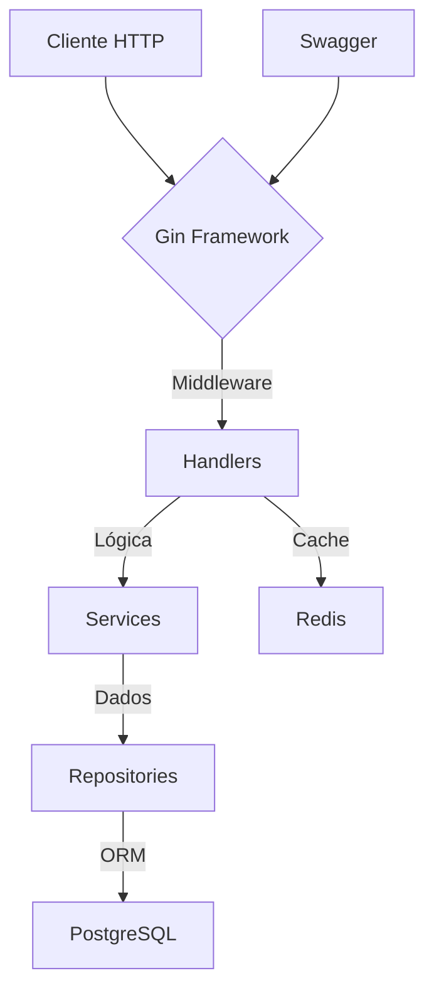

# Backend Golang - API REST com Gin, GORM e Redis

Este serviço é um backend em Go (Golang) utilizando o framework Gin para APIs REST, GORM como ORM para interação com PostgreSQL, Redis para cache e integração com Swagger para documentação.

## 1. Visão Geral

O objetivo deste backend é fornecer uma API REST moderna, performática e escalável, com recursos como:

- Arquitetura em camadas seguindo boas práticas de desenvolvimento
- Documentação automática via Swagger
- Cache com Redis
- Middleware para CORS, logging, recovery e request ID
- Migrações automáticas para o banco de dados
- Docker para facilitar o ambiente de desenvolvimento

## 2. Arquitetura



## 3. Estrutura de Pastas

```
backend-golang/
├── cmd/
│   └── server/
│       └── main.go       # Ponto de entrada da aplicação
├── internal/             # Código interno da aplicação
│   ├── cache/            # Configuração e gerenciamento do Redis
│   ├── database/         # Configuração e migrações do banco de dados
│   ├── handlers/         # Manipuladores de requisições HTTP
│   ├── middleware/       # Middlewares para o Gin
│   ├── models/           # Modelos de dados
│   ├── repository/       # Camada de acesso a dados
│   └── services/         # Lógica de negócios
├── docs/                 # Documentação Swagger gerada automaticamente
├── bin/                  # Binários compilados
├── pkg/                  # Código reutilizável que pode ser importado por outros projetos
├── Dockerfile            # Configuração para containerização
├── docker-compose.yml    # Configuração dos serviços (PostgreSQL, Redis)
├── go.mod                # Dependências do projeto
├── go.sum                # Checksums das dependências
├── Makefile              # Comandos para facilitar o desenvolvimento
├── setup.sh              # Script para configuração inicial
└── README.md             # Documentação do projeto
```

## 4. Componentes Implementados

### 4.1. Middlewares

- **CORS**: Configuração de Cross-Origin Resource Sharing para permitir requisições de diferentes origens
- **Logger**: Logging estruturado com Zap para registrar detalhes das requisições
- **Recovery**: Recuperação de pânicos com registro de erros
- **RequestID**: Identificação única para cada requisição para facilitar o rastreamento
- **Cache**: Middleware para cache de respostas usando Redis

### 4.2. Cache com Redis

- Integração completa com Redis para armazenamento em cache
- Cache configurável por endpoint com TTL personalizado
- Otimização de performance para endpoints de alta demanda

### 4.3. Banco de Dados

- Configuração e conexão com PostgreSQL usando GORM
- Migrações automáticas para o esquema do banco de dados
- Repositórios para acesso a dados seguindo padrões de projeto

### 4.4. API REST

- Roteamento com Gin Framework
- Handlers para processamento de requisições
- Respostas padronizadas em JSON
- Documentação Swagger gerada automaticamente

## 5. Tecnologias Utilizadas

- **Go**: Versão 1.22 ou superior
- **Gin**: Framework web para Go
- **GORM**: ORM para Go
- **PostgreSQL**: Banco de dados relacional
- **Redis**: Armazenamento em cache
- **Swagger**: Documentação de API
- **Docker**: Containerização
- **Zap**: Logging estruturado

## 6. Como Rodar Localmente (Desenvolvimento)

### Pré-requisitos

- Go 1.22+ instalado
- Docker e Docker Compose instalados
- Swag CLI instalado: `go install github.com/swaggo/swag/cmd/swag@latest`

### Comandos do Makefile

O projeto inclui um Makefile com diversos comandos úteis:

```bash
# Compilar o projeto
make build

# Limpar arquivos gerados
make clean

# Organizar dependências
make tidy

# Executar testes
make test

# Gerar documentação Swagger
make swagger

# Iniciar ambiente de desenvolvimento (Docker + aplicação)
make dev-start

# Parar ambiente de desenvolvimento
make dev-stop

# Reconstruir completamente (clean + tidy + swagger + build)
make rebuild

# Acessar Redis CLI
make redis-cli

# Monitorar Redis
make redis-monitor
```

### Passo a Passo

1. **Clone o repositório**:

   ```bash
   git clone <url-do-repositorio>
   cd backend-golang
   ```

2. **Inicie o ambiente de desenvolvimento**:

   ```bash
   make dev-start
   ```

   Isso irá:
   - Iniciar os contêineres do PostgreSQL e Redis
   - Executar as migrações do banco de dados
   - Iniciar a aplicação

3. **Acesse a API**:
   - API: `http://localhost:8888/api/v1/`
   - Swagger: `http://localhost:8888/swagger/index.html`
   - Health Check: `http://localhost:8888/api/v1/health`

## 7. Endpoints da API

Consulte a documentação Swagger para detalhes completos sobre os endpoints disponíveis.

Principais endpoints:

- **GET /api/v1/health**: Verifica o status da aplicação
- **GET /api/v1/items**: Lista todos os items
- **GET /api/v1/items/:id**: Obtém um item específico
- **POST /api/v1/items**: Cria um novo item
- **PUT /api/v1/items/:id**: Atualiza um item existente
- **DELETE /api/v1/items/:id**: Remove um item

## 8. Variáveis de Ambiente

O projeto utiliza variáveis de ambiente para configuração. Crie um arquivo `.env` na raiz do projeto com as seguintes variáveis:

```
# Servidor
PORT=8888
GIN_MODE=debug

# Banco de Dados
DB_HOST=localhost
DB_PORT=5432
DB_USER=postgres
DB_PASSWORD=postgres
DB_NAME=hktn
DB_SSL_MODE=disable

# Redis
REDIS_HOST=localhost
REDIS_PORT=6379
REDIS_PASSWORD=
REDIS_DB=0
```

## 9. Principais Decisões Técnicas

- **Gin Framework**: Escolhido pela performance, facilidade de uso e recursos como middleware
- **Arquitetura em Camadas**: Separação clara entre handlers, services e repositories para facilitar manutenção e testabilidade
- **Redis para Cache**: Implementação de cache para otimizar performance em endpoints de alta demanda
- **Middlewares Personalizados**: Implementação de middlewares para logging, segurança e monitoramento
- **Docker e Makefile**: Facilidade para desenvolvimento, teste e implantação

## 10. Links Úteis

- [Documentação do Gin](https://gin-gonic.com/docs/)
- [Documentação do GORM](https://gorm.io/docs/)
- [Documentação do Redis](https://redis.io/documentation)
- [Swagger com Go](https://github.com/swaggo/gin-swagger)
- [Melhores Práticas em Go](https://go.dev/doc/effective_go)
