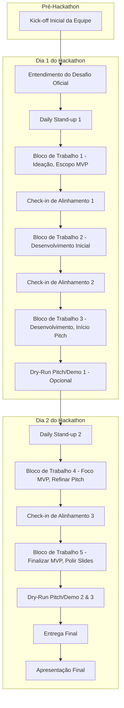

# Configuração e Rituais da Equipe para o Hackathon

Este documento descreve a estrutura sugerida para as equipes da TINNOVA, papéis recomendados e uma cadência mínima de rituais para manter o alinhamento e a produtividade durante o Hackathon Itaú: IA e Multi-Cloud 2025.

## Estrutura da Equipe: Squad Ágil Enxuto

A multidisciplinaridade é chave. O ideal é que cada equipe (squad) combine diferentes habilidades para cobrir todo o ciclo de desenvolvimento da solução, desde a ideação até a apresentação.

### Funções Sugeridas (adaptáveis por equipe)

1. **Product Owner (PO) Relâmpago / Gerente de Projeto (GP):**
    * **Foco:** Visão do produto, entendimento do problema de negócio, priorização do backlog do MVP, representante da equipe em questões não técnicas.
    * **Responsabilidades:** Guardião do problema a ser resolvido, facilitador das discussões de escopo, principal responsável pelo storytelling e estrutura do pitch. Garante que a solução esteja alinhada aos critérios do hackathon.
    * **Perfil:** Boa comunicação, visão de negócio, capacidade de síntese, organização.

2. **Desenvolvedor(es) Backend:**
    * **Foco:** Construção da lógica de servidor, APIs, integração com bancos de dados e outros serviços.
    * **Tecnologias (Kit):** Java (Spring Boot), Python (FastAPI), Go (net/http).
    * **Responsabilidades:** Implementar os endpoints, a lógica de negócio no servidor, e garantir a performance e segurança da API.

3. **Desenvolvedor(es) Frontend:**
    * **Foco:** Interface do usuário (UI), experiência do usuário (UX) do MVP.
    * **Tecnologias (Kit):** Next.js, TypeScript, Ant Design.
    * **Responsabilidades:** Criar as telas da demonstração, consumir as APIs do backend, e garantir uma apresentação visual clara e funcional da solução.

4. **Especialista em Dados / IA:**
    * **Foco:** Implementação dos componentes de Inteligência Artificial da solução.
    * **Tecnologias:** Bibliotecas Python (Pandas, Scikit-Learn, TensorFlow/PyTorch, LangChain, etc.), APIs de IA (OpenAI, Google AI, Azure AI), HuggingFace.
    * **Responsabilidades:** Coleta e preparação de dados (se aplicável), treinamento ou fine-tuning de modelos, integração do modelo de IA com o backend (ex: via API Python).

5. **Arquiteto de Soluções / DevOps (Multi-Cloud):**
    * **Foco:** Desenhar a arquitetura da solução, incluindo a estratégia multi-cloud, e gerenciar a infraestrutura (mesmo que simulada).
    * **Tecnologias (Kit):** Terraform, Docker, Kubernetes (Helm), LocalStack.
    * **Responsabilidades:** Definir quais serviços de quais clouds serão utilizados e porquê (justificativa para multi-cloud), configurar o `docker-compose.yml` para o ambiente de desenvolvimento/demo, e preparar os artefatos de infraestrutura como código (IaC).

6. **Designer UX/UI (Opcional, mas Recomendado):**
    * **Foco:** Garantir que a interface do MVP seja intuitiva, esteticamente agradável e que a demonstração seja fácil de entender.
    * **Responsabilidades:** Criar mockups rápidos, wireframes, e auxiliar o(s) desenvolvedor(es) frontend com o design e a usabilidade. Pode também ajudar significativamente na criação de slides visualmente impactantes para o pitch.

**Observações:**

* Uma pessoa pode acumular mais de um papel, especialmente em equipes menores.
* O importante é que todas as áreas de responsabilidade estejam cobertas.
* A colaboração é mais importante que a hierarquia de papéis.

### Ferramentas de Colaboração e Comunicação

* **Mensageria Instantânea:** Discord, Microsoft Teams, ou WhatsApp (o que for mais ágil para a equipe).
* **Gestão de Tarefas (Simples):** Trello, Asana (versão free), GitHub Issues, ou até mesmo um quadro branco físico/virtual simples.
* **Repositório de Código:** GitHub (utilizando a estrutura de submódulos fornecida).
* **Documentação Compartilhada:** Google Drive, Notion, Confluence (o que a equipe já utiliza).

## Rituais Mínimos (Cadência Ágil Sugerida)

O objetivo não é criar burocracia, mas sim garantir pontos de contato regulares para alinhamento, desbloqueio e adaptação rápida.

1. **Kick-off da Equipe (Pré-Hackathon ou Início Imediato):**
    * **Duração:** 30-60 minutos.
    * **Objetivo:** Revisar o desafio (assim que divulgado), alinhar papéis (quem é o ponto focal para quê), confirmar ferramentas de comunicação e setup inicial do ambiente/repositórios. Discutir a estratégia inicial de abordagem ao problema.

2. **Daily Stand-up (Início de cada dia/período de trabalho):**
    * **Duração:** 10-15 minutos (em pé, se presencial!).
    * **Objetivo:** Sincronia rápida. Cada membro responde brevemente:
        * O que eu fiz desde a última stand-up para ajudar a equipe a atingir o objetivo do MVP?
        * O que eu farei até a próxima stand-up?
        * Quais impedimentos ou bloqueios estou enfrentando?
    * Foco em identificar problemas e quem pode ajudar, não em resolver problemas durante a stand-up.

3. **Check-in de Alinhamento (Ex: a cada 4-6 horas ou ao final de um bloco de trabalho):**
    * **Duração:** 15-20 minutos.
    * **Objetivo:** Revisar o progresso em relação ao MVP, ajustar prioridades se necessário, fazer pequenas demos internas de componentes concluídos, e discutir os próximos passos imediatos.
    * É um bom momento para o PO Relâmpago/GP verificar se o desenvolvimento está no caminho certo para a demo e o pitch.

4. **Dry-Run da Demo/Pitch (Pelo menos 2-3 vezes antes da apresentação final):**
    * **Duração:** Tempo real da apresentação + feedback (ex: 15-30 minutos por ensaio).
    * **Objetivo:** Simular a apresentação final, testar a fluidez da demo, o timing do pitch, a clareza da mensagem e a transição entre os apresentadores (se houver mais de um).
    * Coletar feedback construtivo da própria equipe e ajustar.

5. **Mini-Retrospectiva (Opcional - se o tempo permitir, no final do primeiro dia ou se a equipe sentir necessidade):**
    * **Duração:** 15-20 minutos.
    * **Objetivo:** O que está funcionando bem? O que podemos melhorar no nosso processo/colaboração para o restante do hackathon?

**Dicas para os Rituais:**

* **Sejam Pontuais:** Respeitem o tempo de todos.
* **Mantenham o Foco:** Evitem discussões longas e fora do escopo do ritual.
* **Flexibilidade:** Adapte a frequência e duração dos rituais conforme a necessidade da equipe e o ritmo do hackathon.

O objetivo é ter uma estrutura mínima que promova comunicação, alinhamento e rápida capacidade de resposta a imprevistos, sem engessar a criatividade e a velocidade necessárias para um hackathon.
