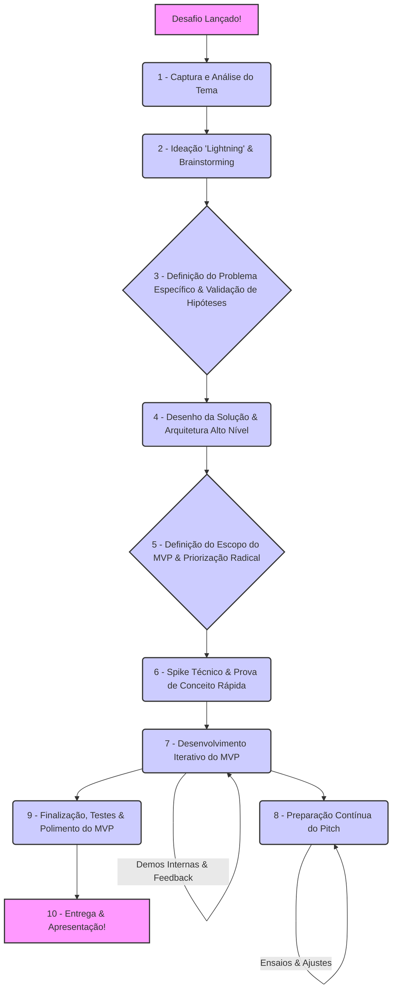

# Workflow Ágil para o Hackathon: Da Ideia ao MVP em Alta Velocidade

Este documento descreve um fluxo de trabalho enxuto e adaptativo, projetado para guiar as equipes da TINNOVA desde a compreensão do desafio do hackathon até a entrega de um MVP (Minimum Viable Product) funcional e um pitch impactante. O foco é na velocidade, colaboração e entregas de valor constantes.

## Princípios Norteadores

* **Foco no Usuário/Problema:** Entender profundamente a dor que está sendo resolvida.
* **Simplicidade e Objetividade:** Evitar complexidade desnecessária no MVP.
* **Iteração Rápida:** Construir, medir, aprender (mesmo que em micro-ciclos).
* **Comunicação Constante:** Alinhamento contínuo dentro da equipe.
* **Priorização Implacável:** "O que NÃO vamos fazer" é tão importante quanto "o que vamos fazer".
* **Entrega de Valor Visível:** O MVP deve demonstrar claramente a proposta de valor.

## Fluxo de Trabalho Detalhado

Este fluxo é uma sugestão e pode ser adaptado pela equipe. Ele se baseia no diagrama de tempo apresentado em `team_setup.md`.

### 1. Captura e Análise do Tema (Logo após o anúncio)

* **Responsável Principal:** PO Relâmpago/GP, com toda a equipe.
* **Atividades:**
  * Leitura individual e em grupo do enunciado completo do desafio.
  * Identificação de palavras-chave, requisitos obrigatórios, critérios de avaliação, e possíveis restrições.
  * Formulação de perguntas para a sessão de Q&A com os organizadores (se houver).
* **Saída Esperada:** Entendimento comum do desafio pela equipe.

### 2. Ideação "Lightning" & Brainstorming

* **Responsável Principal:** Facilitador (pode ser o PO Relâmpago/GP ou outro membro).
* **Atividades:**
  * Técnicas de brainstorming rápido (ex: "How Might We...?", Crazy 8's adaptado).
  * Foco em quantidade de ideias inicialmente, sem julgamento.
  * Conectar as ideias com as tecnologias centrais do hackathon (IA e Multi-Cloud) e os pontos fortes da equipe.
  * Agrupar ideias similares e fazer uma primeira filtragem (ex: votação simples para top 3-5 ideias).
* **Saída Esperada:** Lista curta de 2-3 direções de solução promissoras.

### 3. Definição do Problema Específico & Validação de Hipóteses (KPI)

* **Responsável Principal:** PO Relâmpago/GP, com Especialista em Dados/IA e Arquiteto.
* **Atividades:** Para cada direção de solução:
  * **Formular a Proposta de Valor:** "Nossa solução ajuda [QUEM] a resolver [PROBLEMA ESPECÍFICO] através de [ABORDAGEM IA/MULTI-CLOUD], resultando em [IMPACTO/KPI MENSURÁVEL]."
  * **Identificar o KPI Chave:** Qual a métrica principal que demonstrará o sucesso da solução? (Ex: Redução de X% no tempo de processamento, Aumento de Y% na detecção de anomalias, etc.).
  * **Validação Rápida (Discussão):** Quão realista é atingir um resultado significativo neste KPI durante o hackathon? O problema é relevante para o Itaú?
* **Saída Esperada:** Uma única ideia de solução escolhida pela equipe, com um problema claro e um KPI alvo definido.

#### 3.1 Ferramenta Sugerida: Lean Canvas

O **Lean Canvas** é um quadro de uma página criado por Ash Maurya para modelar negócios enxutos. Ele ajuda a validar rapidamente a viabilidade de uma ideia, concentrando-se nos pontos cruciais em estágios iniciais. Para o hackathon, ele ajuda a alinhar a equipe e a focar no essencial.

**Blocos do Lean Canvas:**

1. **Problema:** Quais são os 1-3 problemas mais críticos do seu cliente-alvo que você tentará resolver?
2. **Segmento de Clientes:** Quem são seus clientes-alvo? Seja específico.
3. **Proposta de Valor Única (UVP):** Qual é a mensagem clara e concisa que explica por que sua solução é diferente e vale a pena ser comprada/usada?
4. **Solução:** Quais são as 3 principais características/funcionalidades do seu MVP que resolvem os problemas identificados?
5. **Métricas-Chave:** Quais são os indicadores chave que mostrarão que sua solução está tendo sucesso e que o MVP atinge o objetivo (relacionado ao KPI definido anteriormente)?
6. **Vantagem Competitiva (ou Diferencial):** O que torna sua solução difícil de ser copiada? Qual seu diferencial único (tecnologia, time, insight)?
7. **Canais:** Como você alcançará seus clientes/usuários (no contexto do hackathon, como os jurados/Itaú tomarão conhecimento e acesso)?
8. **Estrutura de Custos (Simplificada para o Hackathon):** Quais são os principais custos envolvidos para construir e apresentar o MVP (ex: tempo da equipe, uso de APIs pagas se houver)?
9. **Fluxos de Receita (Simplificado para o Hackathon/Pós-Hackathon):** Como sua solução poderia gerar valor/receita para o Itaú ou para os clientes a longo prazo?

**Exemplo Prático Preenchido (Projeto *CloudGuard AI*):**

| Bloco                       | Conteúdo Resumido (Exemplo para CloudGuard AI)                                                                                             |
| --------------------------- | ------------------------------------------------------------------------------------------------------------------------------------------ |
| **Problema**                | 1. Gastos ociosos e imprevisíveis na nuvem.  2. Incidentes de configuração (security drift).  3. Falta de visibilidade cross-provider. |
| **Segmento de Clientes**    | Equipes de FinOps, SecOps e Cloud Ops de grandes instituições financeiras (ex.: Itaú).                                                      |
| **Proposta de Valor Única** | “Corte 30% do custo cloud e feche brechas de segurança em 60 segundos, sem alterar seu pipeline atual.”                                    |
| **Solução (MVP)**           | - Agente IA leve que identifica 'gasto zumbi' e configurações de risco.  - Motor LLM que explica a correção de forma simples.  - Painel Next.js tempo-real com alertas e recomendações. |
| **Métricas-Chave (KPI)**    | • % de custo cloud potencialmente reduzido (estimativa).  • Nº de brechas de segurança críticas identificadas pelo MVP.  • Tempo para identificar uma nova anomalia/risco (simulado na demo). |
| **Vantagem Competitiva**    | 1. Algoritmo híbrido (ex: LightGBM para anomalias + LLM para explicação).  2. Regras de segurança (ex: Rego/OPA) adaptativas e de fácil customização.  3. Deploy simplificado em multi-cloud (ou on-prem) via contêiner único. |
| **Canais (Demo/Pitch)**     | Apresentação no hackathon, demonstração ao vivo do MVP, repositório GitHub com código e documentação.                                     |
| **Estrutura de Custos**     | Tempo de desenvolvimento da equipe, uso de APIs de LLM (se aplicável, buscar free tiers), infra cloud para a demo (buscar free tiers).         |
| **Fluxos de Receita (Visão)** | Potencial de economia direta para o Itaú; modelo SaaS para outras empresas; módulo de remediação automática como upsell.                      |

**Dicas para usar o Lean Canvas no Hackathon:**

1. **Preenchimento Rápido (Ideal < 30-60 min):** Reúna a equipe, use post-its, um quadro branco ou uma ferramenta digital colaborativa (Figma, Miro, etc.). O objetivo é a discussão e o alinhamento, não a perfeição.
2. **Foco no MVP do Hackathon:** Adapte as perguntas para o contexto de um produto a ser demonstrado em poucos dias.
3. **Iterativo:** O Lean Canvas não é estático. Revisite e ajuste conforme a ideia evolui e novos aprendizados surgem durante o desenvolvimento.
4. **Guia para o Pitch:** Cada bloco do Lean Canvas pode se transformar em um slide ou um ponto chave do seu pitch, ajudando a construir uma narrativa coesa.
5. **Alinhamento da Equipe:** Garante que todos tenham uma compreensão compartilhada do que está sendo construído e por quê, minimizando desalinhamentos.

Ao final desta etapa, com o Lean Canvas preenchido (mesmo que de forma resumida), a equipe terá uma base sólida para prosseguir com o desenho da solução e a priorização do escopo do MVP.

### 4. Desenho da Solução & Arquitetura Alto Nível

* **Responsável Principal:** Arquiteto/DevOps, com Desenvolvedores Backend/Frontend e Especialista IA.
* **Atividades:**
  * Esboçar a jornada do usuário principal do MVP.
  * Diagrama simples dos componentes: Frontend (Next.js) ↔ Backend API (Java/Python/Go) ↔ Serviço de IA (Python) ↔ (Possível) Mock de Banco de Dados.
  * Decidir quais serviços de cloud seriam usados em um cenário real e porquê (para justificar a estratégia Multi-Cloud no pitch).
  * Definir as principais integrações e fluxos de dados.
* **Saída Esperada:** Um esboço da arquitetura e do fluxo de usuário do MVP.

### 5. Definição do Escopo do MVP & Priorização Radical

* **Responsável Principal:** PO Relâmpago/GP, com toda a equipe.
* **Atividades:**
  * Listar todas as funcionalidades desejadas para a solução completa.
  * Priorizar brutalmente usando MoSCoW (Must have, Should have, Could have, Won't have) focado no que é essencial para o MVP e para a demo do pitch.
  * **Template de User Story Microscópica (para os "Must Haves" do MVP):**
    * **COMO UM** [Tipo de Usuário/Persona]
    * **EU QUERO** [Realizar uma Ação/Funcionalidade específica]
    * **PARA QUE** [Benefício/Resultado Chave relacionado ao KPI]
  * **Definição de "Ready" (para uma User Story entrar em desenvolvimento):**
    * História bem escrita (clara, concisa).
    * Critérios de aceitação mínimos definidos (o que precisa acontecer para ser considerada "pronta"?).
    * Discussão e entendimento pela equipe de desenvolvimento.
  * **Definição de "Done" (para uma User Story ser considerada concluída):**
    * Código implementado conforme a história.
    * Testes mínimos realizados (pelo menos um teste manual do fluxo feliz).
    * Integrado à branch principal (ou de desenvolvimento).
    * (Idealmente) Demonstrado rapidamente para o PO Relâmpago/GP.
* **Saída Esperada:** Backlog do MVP com 3-5 User Stories "Must Have" muito claras e pequenas.

### 6. Spike Técnico & Prova de Conceito Rápida (Opcional, se houver incerteza crítica)

* **Responsável Principal:** Desenvolvedor(es) com a maior incerteza técnica.
* **Atividades:** Se houver uma parte crítica da solução com alta incerteza técnica (ex: integração com uma API de IA desconhecida, um algoritmo complexo), dedicar um tempo curto (1-2 horas) para um "spike".
  * Objetivo: Validar a viabilidade técnica, não construir a funcionalidade completa.
* **Saída Esperada:** Confiança (ou não) na abordagem técnica para uma parte crítica.

### 7. Desenvolvimento Iterativo do MVP

* **Responsável Principal:** Todos os desenvolvedores, Especialista IA, Arquiteto.
* **Atividades:**
  * Desenvolver as User Stories do MVP, uma de cada vez ou em paralelo se bem coordenadas.
  * Utilizar os boilerplates para acelerar.
  * Fazer check-ins frequentes (ver `team_setup.md`).
  * Realizar demos internas curtas à medida que as funcionalidades são concluídas.
  * Foco em ter ALGO FUNCIONANDO que possa ser demonstrado o mais rápido possível.
* **Saída Esperada:** Componentes do MVP sendo entregues e integrados continuamente.

### 8. Preparação Contínua do Pitch

* **Responsável Principal:** PO Relâmpago/GP, com suporte do Designer (se houver) e inputs da equipe.
* **Atividades:** (Paralelo ao desenvolvimento)
  * Estruturar os slides (reaproveitar `pitch_guide.md` e mocks).
  * Escrever o roteiro, focando na clareza e impacto.
  * Coletar screenshots ou gravar pequenos vídeos de funcionalidades prontas para incluir nos slides ou como backup da demo ao vivo.
  * Ensaiar, ensaiar, ensaiar.
* **Saída Esperada:** Versões incrementais do pitch e dos slides.

### 9. Finalização, Testes & Polimento do MVP

* **Responsável Principal:** Toda a equipe.
* **Atividades:**
  * "Feature Freeze": Algumas horas antes da entrega, parar de adicionar novas funcionalidades.
  * Foco em corrigir bugs críticos nas funcionalidades do MVP.
  * Testar exaustivamente o fluxo da demo.
  * Garantir que o ambiente da demo (Docker Compose local) está estável.
  * Polir a UI (se o tempo permitir).
* **Saída Esperada:** MVP estável e pronto para a demonstração.

### 10. Entrega & Apresentação

* **Responsável Principal:** PO Relâmpago/GP e quem for apresentar.
* **Atividades:**
  * Submeter todos os artefatos necessários (código, slides, vídeo se pedido) COM ANTECEDÊNCIA.
  * Realizar a apresentação com confiança e energia!
* **Saída Esperada:** Missão cumprida!

Este fluxo visa maximizar a entrega de valor em um ambiente de tempo restrito, promovendo agilidade e foco no que realmente importa para uma boa avaliação no hackathon.
