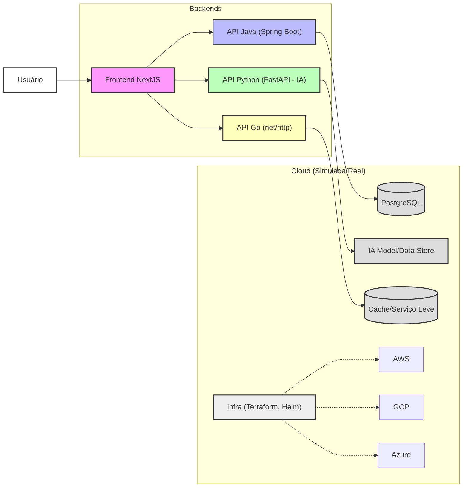

# Visão Geral da Stack Tecnológica - Hackathon IA + Multi-Cloud 2025

Este documento descreve a stack tecnológica, padrões de código, convenções de nomenclatura e links úteis para cada serviço do projeto.

## 1. Tecnologias Globais

* **Gerenciamento de Repositório:** Git, GitHub
* **Metodologia:** Mono-repo com Submódulos Git
* **Contêineres:** Docker, Docker Compose
* **Automação (Build/Run):** Makefile (raiz)
* **Linguagem de Documentação:** Markdown

## 2. Serviços e Stacks Específicas

### 2.1. `backend-java`

* **Linguagem:** Java 21 (ou versão LTS mais recente compatível com Spring Boot 3)
* **Framework:** Spring Boot 3.x
* **Build Tool:** Gradle (Kotlin DSL)
* **APIs:** RESTful (Spring Web MVC)
* **Documentação de API:** Springdoc OpenAPI (Swagger UI em `/swagger-ui.html`)
* **Banco de Dados (local/dev):** H2 (em memória), PostgreSQL (via Docker Compose para ambiente mais próximo da produção)
* **Padrões de Código:**
  * Seguir as convenções do Spring Boot e Java.
  * Utilizar Lombok para reduzir boilerplate (se a equipe concordar).
  * Organização em pacotes: `com.hackathon.<modulo>.<camada>` (ex: `com.hackathon.users.controller`, `com.hackathon.users.service`, `com.hackathon.users.repository`, `com.hackathon.users.model`).
* **Convenções de Nomenclatura:**
  * Classes: `PascalCase`
  * Métodos e Variáveis: `camelCase`
  * Constantes: `UPPER_SNAKE_CASE`
  * Endpoints REST: `kebab-case` (ex: `/api/user-profiles`, `/api/orders`)
* **Links Úteis:**
  * [Spring Boot](https://spring.io/projects/spring-boot)
  * [Gradle Kotlin DSL](https://docs.gradle.org/current/userguide/kotlin_dsl.html)
  * [Springdoc OpenAPI](https://springdoc.org/)

### 2.2. `backend-python`

* **Linguagem:** Python 3.11+
* **Framework:** FastAPI
* **Servidor ASGI:** Uvicorn
* **Pipelines de IA/ML:**
  * Pandas, NumPy, Scikit-learn
  * Frameworks de Deep Learning (PyTorch ou TensorFlow/Keras, conforme necessidade)
  * Bibliotecas para LLMs (Hugging Face Transformers, LangChain, OpenAI SDK - se aplicável)
* **Documentação de API:** FastAPI auto-gerada (Swagger UI em `/docs`, ReDoc em `/redoc`)
* **Padrões de Código:**
  * PEP 8
  * Type Hints obrigatórios.
  * Organização em módulos e pacotes lógicos.
* **Convenções de Nomenclatura:**
  * Módulos e Pacotes: `snake_case`
  * Classes: `PascalCase`
  * Funções e Variáveis: `snake_case`
  * Constantes: `UPPER_SNAKE_CASE`
* **Links Úteis:**
  * [FastAPI](https://fastapi.tiangolo.com/)
  * [Pandas](https://pandas.pydata.org/)
  * [Hugging Face Transformers](https://huggingface.co/docs/transformers/index)

### 2.3. `backend-golang`

* **Linguagem:** Go 1.22+
* **Bibliotecas HTTP:** `net/http` (padrão Go)
* **Roteador (opcional, se `net/http` puro não for suficiente):** `gorilla/mux` ou `chi`
* **Documentação de API:** `swaggo/swag` (gera Swagger UI em `/swagger/index.html`)
* **Padrões de Código:**
  * Go Code Review Comments ([Effective Go](https://go.dev/doc/effective_go), [Go Proverbs](https://go-proverbs.github.io/))
  * Estrutura de projeto sugerida:

        ```
        /cmd (ou raiz para main.go simples)
        /internal (ou /pkg para código compartilhado, mas /internal é preferível para lógica de app)
          /handlers
          /services
          /models
          /repository (se houver persistência)
        /api (definições de API, ex: arquivos .proto se usar gRPC, ou structs de request/response)
        ```

* **Convenções de Nomenclatura:**
  * Pacotes: `snake_case` (curtos e concisos)
  * Variáveis e Funções Exportadas: `PascalCase`
  * Variáveis e Funções Não Exportadas: `camelCase`
* **Links Úteis:**
  * [Go Website](https://go.dev/)
  * [swaggo/swag](https://github.com/swaggo/swag)
  * [Standard Go Project Layout (referência, não dogma)](https://github.com/golang-standards/project-layout)

### 2.4. `frontend`

* **Framework:** Next.js 14+
* **Linguagem:** TypeScript
* **UI Kit:** Ant Design
* **Gerenciador de Estado (opcional, se necessário):** Zustand, Jotai, ou Context API do React para casos simples.
* **Chamadas API:** Axios ou Fetch API nativa.
* **Padrões de Código:**
  * Convenções do Next.js e React.
  * ESLint e Prettier configurados.
  * Estrutura de pastas: `src/app` (App Router), `src/components`, `src/lib`, `src/hooks`, `src/services`, `src/styles`, etc.
* **Convenções de Nomenclatura:**
  * Componentes e Arquivos TSX: `PascalCase.tsx`
  * Funções e Variáveis: `camelCase`
  * Estilos (CSS Modules ou Tailwind classes).
* **Links Úteis:**
  * [Next.js](https://nextjs.org/)
  * [TypeScript](https://www.typescriptlang.org/)
  * [Ant Design](https://ant.design/)

### 2.5. `infra`

* **Infraestrutura como Código (IaC):** Terraform
  * **Provedores:** AWS, GCP, Azure (foco multi-cloud simulado/real)
  * **Estrutura:** Módulos Terraform por provedor e/ou serviço.
* **Gerenciamento de Configuração/Deploy K8s:** Helm Charts
* **Ambiente de Desenvolvimento Local (Cloud Mocks):** LocalStack
* **Padrões de Código:**
  * Terraform: Seguir as melhores práticas da HashiCorp, DRY.
  * Helm: Estrutura de chart padrão.
* **Convenções de Nomenclatura:**
  * Recursos Terraform: `snake_case` (ex: `aws_s3_bucket.my_bucket`)
  * Variáveis Terraform: `snake_case`
* **Links Úteis:**
  * [Terraform](https://www.terraform.io/)
  * [Helm](https://helm.sh/)
  * [LocalStack](https://localstack.cloud/)
  * [AWS Provider (Terraform)](https://registry.terraform.io/providers/hashicorp/aws/latest/docs)
  * [Google Cloud Provider (Terraform)](https://registry.terraform.io/providers/hashicorp/google/latest/docs)
  * [Azure Provider (Terraform)](https://registry.terraform.io/providers/hashicorp/azurerm/latest/docs)

## 3. Diagrama de Interação dos Serviços (Mermaid)

O diagrama abaixo ilustra a interação geral entre os serviços:



## 4. Padrões de Commit

Ver `CONTRIBUTING.md`.

## 5. Fluxo de Branch

Ver `CONTRIBUTING.md`.
